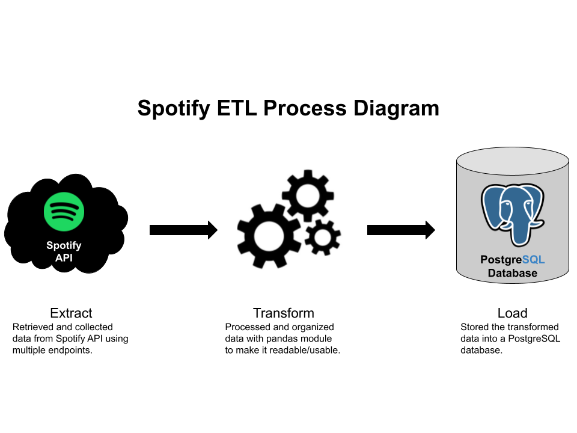

# Spotify-ETL-Pipeline
Spotify API data extracted, transformed, and loaded onto a Postgres Database.

# Spotify ETL Process Diagram

# Files not included
- .env (contains environment variables for API security connection)
- ETLpipeline.ini (contains configuated variables for PostgreSQL-database connection)

# Packages to install (Linux/Unix)
- $ pip install spotipy python-dotenv (for spotify api and .env files)
- $ pip install pandas (for pandas module)
- $ pip install numpy (for numpy module)
- $ pip install openpyxl (for excel writer)
- $ pip install psycopg2 (for postgres database connection)
